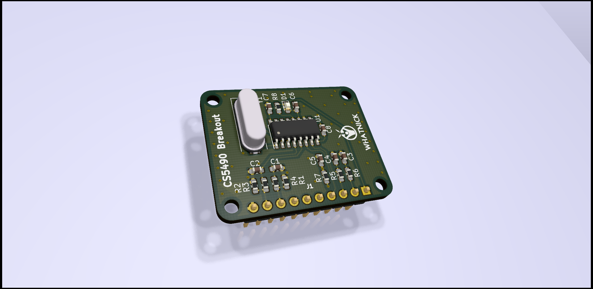
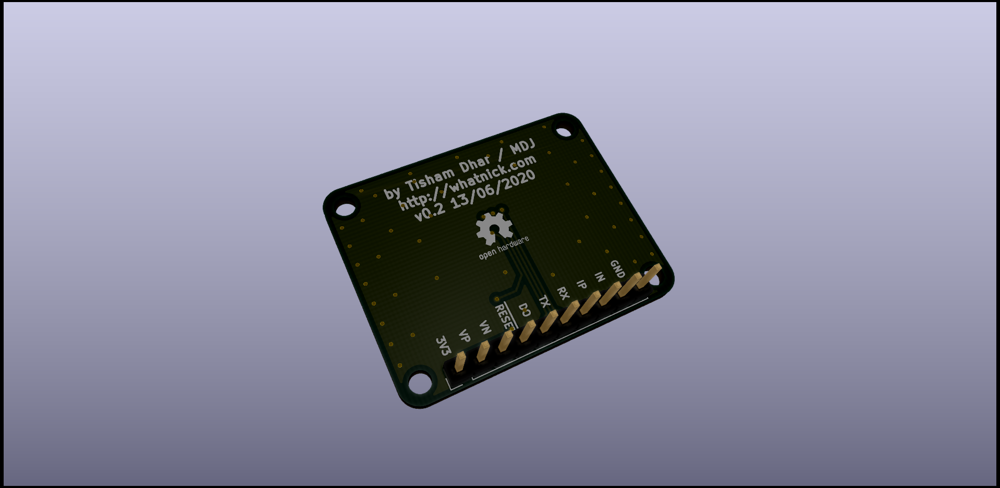

# CS5490 Breakout v0.2

Breakout board for breadboard testing using the [CS5490](https://www.cirrus.com/products/cs5490/) Energy Monitor ASIC from Cirrus Logic.

## Where to get the board

The board can be obtained on:
- [OSHPark](https://oshpark.com/shared_projects/akd2GqB2)
- [PCBWay](https://www.pcbway.com/project/shareproject/CS5490_Breakout_V0_2.html)

## Board Images

**Top Render**

**Bottom Render**

## Software Support

- [Arduino Library](https://github.com/tiagolobao/CS5490)
- [Micropython/Python Notebook](https://github.com/whatnick/cs5490_micropython)
